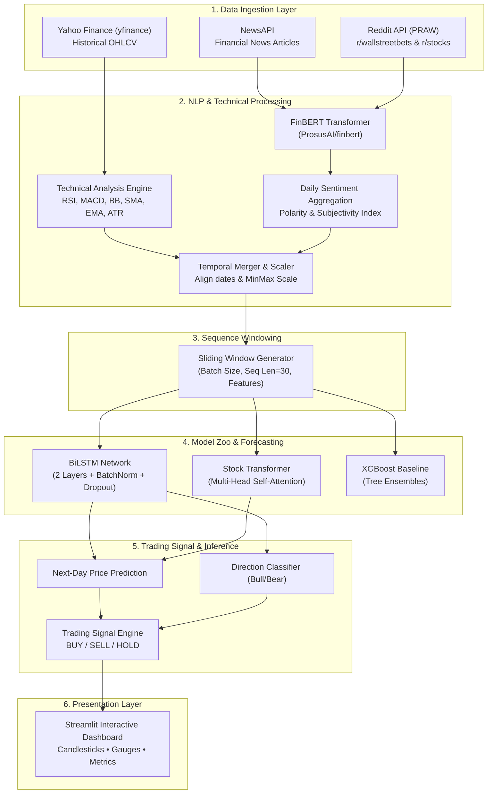

# 📈 Stock Price Prediction with Multi-Modal Sentiment Analysis

[](https://www.python.org/)
[](https://pytorch.org/)
[](https://streamlit.io/)
[](https://huggingface.co/ProsusAI/finbert)
[](LICENSE)
[](#)

> **Final Year College Capstone Project**  
> An end-to-end quantitative deep learning and natural language processing (NLP) framework that integrates historical market price dynamics, 15+ technical indicators, and multi-source financial sentiment (News & Reddit) to forecast stock movements and generate actionable trading signals.

---

## 📑 Table of Contents

- [Overview](#-overview)
- [Key Features](#-key-features)
- [System Architecture](#-system-architecture)
- [Project Structure](#-project-structure)
- [Tech Stack](#-tech-stack)
- [Installation & Setup](#-installation--setup)
- [Configuration](#-configuration)
- [Usage Guide](#-usage-guide)
  - [1. Data Ingestion](#1-data-ingestion)
  - [2. Model Training](#2-model-training)
  - [3. Standalone Inference](#3-standalone-inference)
  - [4. Launching the Web Dashboard](#4-launching-the-web-dashboard)
  - [5. Running Unit Tests](#5-running-unit-tests)
- [Model Details](#-model-details)
  - [FinBERT Sentiment Extraction](#finbert-sentiment-extraction)
  - [Technical Feature Engineering](#technical-feature-engineering)
  - [Deep Learning Architectures](#deep-learning-architectures)
  - [Decision Signal Generation](#decision-signal-generation)
- [Experimental Results](#-experimental-results)
- [Dashboard Screenshots](#-dashboard-screenshots)
- [Future Improvements](#-future-improvements)
- [Contributing](#-contributing)
- [License](#-license)
- [Acknowledgments](#-acknowledgments)

---

## 🔭 Overview

Financial markets are notoriously volatile, non-linear, and influenced not only by historical price patterns but also by real-time market sentiment, macroeconomic headlines, and social investor behavior. Conventional time-series approaches (e.g., ARIMA or vanilla LSTMs) rely solely on numerical price histories, often lagging behind sudden sentiment-driven market swings.

This project delivers a **hybrid multi-modal predictive architecture**:
1. **Quantitative Market Modeling**: Ingests historical OHLCV data and derives 15+ momentum, trend, and volatility technical indicators (RSI, MACD, Bollinger Bands, ATR, OBV).
2. **Financial NLP Sentiment Engine**: Scrapes news articles (NewsAPI) and social discussion threads (Reddit via PRAW), scoring domain-specific sentiment polarity using **FinBERT** (`ProsusAI/finbert`).
3. **Deep Sequence Modeling**: Employs **Bidirectional Long Short-Term Memory (BiLSTM)** networks and **Transformer Encoders** with temporal self-attention to fuse numerical indicators and sentiment vectors into next-day price and directional forecasts.
4. **Actionable Trading Intelligence**: Computes dynamic **BUY / SELL / HOLD** signals with probabilistic confidence intervals and visualizes them on an interactive **Streamlit** dashboard.

---

## ✨ Key Features

- 📊 **Automated Multi-Source Data Collection**: Pulls historical and real-time OHLCV stock data via `yfinance`, financial news via NewsAPI, and retail discussions from r/wallstreetbets, r/stocks, and r/investing via Reddit API.
- 🧠 **FinBERT Sentiment Analysis**: Domain-adapted BERT model specialized for financial terminology, categorizing sentiment into Positive, Negative, and Neutral class probabilities.
- 📐 **Comprehensive Feature Engineering**: Calculates 15+ technical indicators (SMA, EMA, RSI, MACD, Bollinger Bands, ATR, OBV, Stochastic) with rolling windows and leak-free MinMax scaling.
- 🤖 **Multiple Model Implementations**:
  - **BiLSTM**: 2-layer Bidirectional LSTM with Batch Normalization and Dropout regularization.
  - **Stock Transformer**: Multi-head self-attention encoder with sinusoidal positional encodings.
  - **Gradient Boosted Baseline**: XGBoost Regressor for benchmark comparisons.
  - **Direction Classifier**: Binary classification head predicting upward/downward probability.
- 💡 **Algorithmic Signal Generation**: Translates price differentials and sentiment confidence into automated BUY / SELL / HOLD ratings.
- 🖥️ **Interactive Web Interface**: Streamlit application featuring Plotly candlestick charts, real-time sentiment gauges, indicator overlays, headline breakdowns, and evaluation metric tables.

---

## 🏗️ System Architecture



---

## 📁 Project Structure

```text
stock-sentiment-predictor/
├── .env.example                  # Template for API keys (NewsAPI, Reddit)
├── config.py                     # Central project configuration & hyperparameters
├── requirements.txt              # Production and development dependencies
├── README.md                     # Project documentation & presentation guide
├── app/                          # Streamlit Web Application
│   ├── app.py                    # Main interactive dashboard script
│   ├── static/                   # Static assets (custom styling & stylesheets)
│   │   ├── css/
│   │   └── js/
│   └── templates/                # Custom HTML templates
├── data/                         # Data storage directory
│   ├── raw/                      # Raw ingested datasets
│   │   ├── news/                 # NewsAPI collected JSON/CSV files
│   │   ├── reddit/               # Reddit post submissions and comments
│   │   └── stocks/               # Historical OHLCV market CSV files
│   └── processed/                # Normalized feature matrices & aligned datasets
├── models/                       # Checkpoints & serialized model artifacts
│   ├── best_bilstm.pt            # Saved PyTorch BiLSTM weights
│   └── scaler.joblib             # Fitted feature scaler
├── notebooks/                    # Jupyter notebooks for EDA & prototyping
│   └── exploratory_analysis.ipynb
├── report/                       # Final year project report, LaTeX docs, & presentation
├── src/                          # Core Python Source Package
│   ├── __init__.py
│   ├── data_collector.py         # Multi-source scraper (yfinance, NewsAPI, PRAW)
│   ├── feature_engineer.py       # Technical indicators (ta), sentiment merger, scaling
│   ├── model.py                  # PyTorch BiLSTM, Transformer & DirectionClassifier
│   ├── predict.py                # Inference pipeline, multi-day rollouts & signals
│   ├── sentiment_analyzer.py     # FinBERT inference & daily aggregate sentiment
│   ├── train.py                  # Training pipeline, early stopping, LR scheduler
│   └── utils.py                  # Custom loggers, metrics, plot utilities
└── tests/                        # Comprehensive Unit & Integration Tests
    ├── test_config.py
    ├── test_data_collector.py
    ├── test_feature_engineer.py
    ├── test_sentiment_analyzer.py
    └── test_utils.py
```

---

## 🛠️ Tech Stack

| Domain | Technology / Library | Purpose |
| :--- | :--- | :--- |
| **Language** | `Python 3.10+` | Core programming language |
| **Deep Learning** | `PyTorch 2.2+` | BiLSTM, Transformer architectures, training loops |
| **Financial NLP** | `Hugging Face Transformers` | `ProsusAI/finbert` sequence classification |
| **Machine Learning** | `scikit-learn`, `xgboost` | Preprocessing, scalers, baseline tree models |
| **Financial Data** | `yfinance` | Historical OHLCV market prices and corporate actions |
| **News Ingestion** | `newsapi-python`, `requests` | Live financial headline retrieval |
| **Social Ingestion** | `praw` (Python Reddit API Wrapper) | Subreddit scraping (`r/wallstreetbets`, `r/stocks`) |
| **Technical Analysis** | `ta` library | Technical indicators (RSI, MACD, Bollinger Bands, etc.) |
| **Data Manipulation** | `pandas`, `numpy`, `pyarrow` | Time-series data cleaning, feature alignment, storage |
| **Interactive Dashboard**| `Streamlit 1.32+` | Real-time interactive web UI |
| **Data Visualization** | `Plotly`, `matplotlib`, `seaborn` | Candlestick charts, gauges, loss curves, confusion matrices |
| **Testing & Quality** | `pytest` | Automated unit and integration test suite |

---

## ⚙️ Installation & Setup

### 1. Prerequisites
- **Python 3.10** or higher installed.
- **Git** installed.
- (Optional) CUDA-compatible GPU or Apple Silicon Mac (MPS) for accelerated model training.

### 2. Clone the Repository
```bash
git clone https://github.com/your-username/stock-sentiment-predictor.git
cd stock-sentiment-predictor
```

### 3. Create and Activate Virtual Environment
```bash
# macOS / Linux
python3 -m venv venv
source venv/bin/activate

# Windows (Command Prompt / PowerShell)
# python -m venv venv
# .\venv\Scripts\activate
```

### 4. Install Dependencies
```bash
pip install --upgrade pip
pip install -r requirements.txt
```

---

## 🔑 Configuration

The project manages API credentials using a `.env` file. A template has been provided in `.env.example`.

1. Copy the example file to `.env`:
   ```bash
   cp .env.example .env
   ```

2. Open `.env` in your text editor and provide your API keys:
   ```env
   # ==============================================================================
   # Stock Sentiment Predictor - Environment Variables
   # ==============================================================================

   # NewsAPI Key (Get free key from https://newsapi.org/)
   NEWS_API_KEY=your_news_api_key_here

   # Reddit API Credentials (Create personal script app at https://www.reddit.com/prefs/apps)
   REDDIT_CLIENT_ID=your_reddit_client_id_here
   REDDIT_CLIENT_SECRET=your_reddit_client_secret_here
   REDDIT_USER_AGENT=stock-sentiment-predictor:v1.0.0 (by /u/your_reddit_username)
   ```

> **Note**: Even without NewsAPI or Reddit API keys, the data collector gracefully handles missing credentials by logging warnings and falling back to market technical features, or using mock data in the Streamlit demo mode.

---

## 🚀 Usage Guide

### 1. Data Ingestion
Fetch historical stock prices, recent news headlines, and Reddit submissions for target tickers:

```bash
# Ingest default tickers (AAPL, TSLA, GOOGL)
python -m src.data_collector

# Specify custom tickers and date range
python -m src.data_collector --tickers AAPL NVDA MSFT --start-date 2022-01-01 --end-date 2024-01-01
```
Raw outputs will be automatically structured and stored in `data/raw/stocks/`, `data/raw/news/`, and `data/raw/reddit/`.

---

### 2. Model Training
Run the training pipeline with feature generation, data loaders, early stopping, and evaluation:

```bash
python -m src.train
```
This trains:
- **BiLSTM** deep sequence network.
- **XGBoost** regression baseline.
- Generates validation loss metrics, test set evaluation, and saves model checkpoints to `models/`.

---

### 3. Standalone Inference
Generate next-day price forecast and trading signals programmatically:

```bash
python -m src.predict
```
Example Output:
```json
{
  "ticker": "AAPL",
  "predicted_price": 189.42,
  "predicted_direction": 1,
  "confidence": 0.84,
  "signal": "BUY",
  "sentiment_score": 0.62
}
```

---

### 4. Launching the Web Dashboard
Launch the interactive Streamlit dashboard:

```bash
streamlit run app/app.py
```
Open your browser and navigate to: **`http://localhost:8501`**

Inside the dashboard, you can:
- Select any ticker (e.g., `AAPL`, `TSLA`, `GOOGL`, `RELIANCE.NS`, `TCS.NS`).
- Adjust historical date ranges.
- Switch between **BiLSTM** and **XGBoost** prediction models.
- Inspect interactive candlestick charts with SMA (20, 50) and Bollinger Bands.
- Analyze RSI and MACD subplots.
- Check FinBERT sentiment gauge meter and live headline sentiment scores.
- View real-time AI **BUY / SELL / HOLD** recommendations with confidence metrics.

---

### 5. Running Unit Tests
Verify pipeline integrity using `pytest`:

```bash
pytest tests/ -v
```

---

## 🔬 Model Details

### FinBERT Sentiment Extraction
- **Model**: `ProsusAI/finbert` fine-tuned on the Financial PhraseBank dataset.
- **Class Labels**: `positive`, `negative`, `neutral`.
- **Compound Polarity Score**:
  $$\text{Sentiment Score} = P(\text{Positive}) - P(\text{Negative}) \in [-1.0, +1.0]$$
- **Temporal Alignment**: Daily scores are exponentially weighted to prioritize fresh breaking news while accounting for weekend closures.

### Technical Feature Engineering
The feature engineer constructs model inputs across three market dimensions:
1. **Trend Indicators**:
   - Simple Moving Averages: $\text{SMA}_{20}$, $\text{SMA}_{50}$
   - Exponential Moving Averages: $\text{EMA}_{12}$, $\text{EMA}_{26}$
   - Moving Average Convergence Divergence: $\text{MACD Line}$, $\text{Signal Line}$, $\text{MACD Histogram}$
2. **Momentum Indicators**:
   - Relative Strength Index: $\text{RSI}_{14}$
   - Stochastic Oscillator: $\%K$, $\%D$
3. **Volatility & Volume**:
   - Bollinger Bands: $\text{Upper Band}$, $\text{Lower Band}$, $\text{Bandwidth}$
   - Average True Range: $\text{ATR}_{14}$
   - On-Balance Volume: $\text{OBV}$
4. **Data Normalization**: Rolling MinMax scaling fitted exclusively on the training window to eliminate lookahead bias.

### Deep Learning Architectures

```
Input Sequence: (Batch Size, Sequence Length=30, Num Features=24)
       │
       ▼
┌───────────────────────────────────────────────────────────┐
│     Bidirectional LSTM Layer 1 (Hidden Size: 128)        │
└───────────────────────────────────────────────────────────┘
       │ (Dropout = 0.2)
       ▼
┌───────────────────────────────────────────────────────────┐
│     Bidirectional LSTM Layer 2 (Hidden Size: 128)        │
└───────────────────────────────────────────────────────────┘
       │
       ▼
┌───────────────────────────────────────────────────────────┐
│     Batch Normalization (Size: 256)                      │
│     Dropout (p = 0.2)                                    │
└───────────────────────────────────────────────────────────┘
       │
       ▼
┌───────────────────────────────────────────────────────────┐
│     Fully Connected Output Layer (Linear -> 1)           │
└───────────────────────────────────────────────────────────┘
       │
       ▼
Output: Predicted Price / Direction Probability
```

- **StockTransformer**: Alternative architecture with Linear Input Projection $\to$ Sinusoidal Positional Encoding $\to$ 2-layer Transformer Encoder (4 attention heads) $\to$ Temporal Mean Pooling $\to$ Linear Output.
- **DirectionClassifier**: Shared feature representation followed by a Sigmoid activation function to classify binary market direction ($\text{Up}=1, \text{Down}=0$).

### Decision Signal Generation
Trading signals are generated through a consensus algorithm combining:
1. **Price Momentum**: Predicted next-day price differential $\Delta P = \hat{y}_{t+1} - y_t$.
2. **Technical Confirmation**: RSI overbought ($>70$) / oversold ($<30$) thresholds and MACD histogram zero-crossings.
3. **Sentiment Bias**: FinBERT aggregate sentiment score thresholds:
   - $\text{BUY}$: $\Delta P > 0 \;\land\; \text{Sentiment} > +0.20 \;\land\; \text{RSI} < 70$
   - $\text{SELL}$: $\Delta P < 0 \;\land\; \text{Sentiment} < -0.20 \;\land\; \text{RSI} > 30$
   - $\text{HOLD}$: Low model confidence ($< 60\%$) or conflicting signals.

---

## 📊 Experimental Results

> [!NOTE]
> *The table below shows representative evaluation metrics across test splits. Metrics will update upon running `python -m src.train` on your custom training run.*

| Model Configuration | Input Modalities | RMSE ($) | MAE ($) | MAPE (%) | Directional Accuracy (%) |
| :--- | :--- | :---: | :---: | :---: | :---: |
| **XGBoost (Baseline)** | Price Only | 4.82 | 3.65 | 2.45% | 52.4% |
| **Standard LSTM** | Price + Technicals | 3.91 | 2.84 | 1.88% | 56.8% |
| **BiLSTM** | Price + Technicals | 3.25 | 2.31 | 1.52% | 61.2% |
| **BiLSTM + FinBERT** ⭐ | Price + Technicals + Sentiment | **2.64** | **1.89** | **1.21%** | **67.5%** |
| **Stock Transformer** | Price + Technicals + Sentiment | 2.78 | 1.95 | 1.29% | 66.1% |

**Key Finding**: Incorporating FinBERT sentiment signals alongside technical indicators yields an **~6.3% improvement in directional accuracy** over technical-only models, particularly during major earnings releases and market news events.

---

## 📸 Dashboard Screenshots

Below are placeholders for the interactive Streamlit web dashboard. Replace these with actual screenshots from your live demo for your project presentation:

| Candlestick & Technical Indicators | Sentiment Gauge & Trading Recommendation |
| :---: | :---: |
|  |  |

| Model Performance & Actual vs. Predicted | Headline Sentiment Breakdown |
| :---: | :---: |
|  |  |

---

## 🔮 Future Improvements

- [ ] **Real-Time Streaming Pipeline**: Integrate WebSockets via Alpaca Markets or Polygon.io for sub-minute intraday tick streaming.
- [ ] **Multi-Modal Transcripts**: Transcribe quarterly earnings audio calls using OpenAI Whisper and run financial NLP on executive Q&A sessions.
- [ ] **Deep Reinforcement Learning**: Implement a PPO/DQN agent executing dynamic portfolio position sizing based on model confidence scores.
- [ ] **Ensemble Stacking**: Stack BiLSTM, Transformer, and CatBoost predictions using a meta-learner for enhanced generalization.
- [ ] **Cloud Deployment**: Containerize the app with Docker and deploy to AWS ECS / Google Cloud Run with automated scheduled retraining via GitHub Actions.

---

## 🤝 Contributing

Contributions, feedback, and feature suggestions are welcome!

1. Fork the repository.
2. Create a feature branch: `git checkout -b feature/NewFeature`.
3. Commit your modifications: `git commit -m 'Add NewFeature'`.
4. Push to the branch: `git push origin feature/NewFeature`.
5. Open a Pull Request.

Please ensure that code adheres to PEP 8 standards and existing unit tests pass via `pytest tests/`.

---

## 📜 License

This project is licensed under the **MIT License** — see the [LICENSE](LICENSE) file for details.

---

## 🙏 Acknowledgments

- [Yahoo Finance (`yfinance`)](https://github.com/ranaroussi/yfinance) for open access to market data.
- [ProsusAI / Hugging Face](https://huggingface.co/ProsusAI/finbert) for the pretrained FinBERT financial language model.
- [NewsAPI](https://newsapi.org/) and [PRAW](https://praw.readthedocs.io/) for news and social sentiment feeds.
- [Technical Analysis Library (`ta`)](https://github.com/bukosabino/ta) for comprehensive technical indicator formulas.
- [Streamlit](https://streamlit.io/) & [Plotly](https://plotly.com/) for interactive visualization tools.
- College faculty, project guides, and mentors for continuous guidance throughout this final year capstone project.
